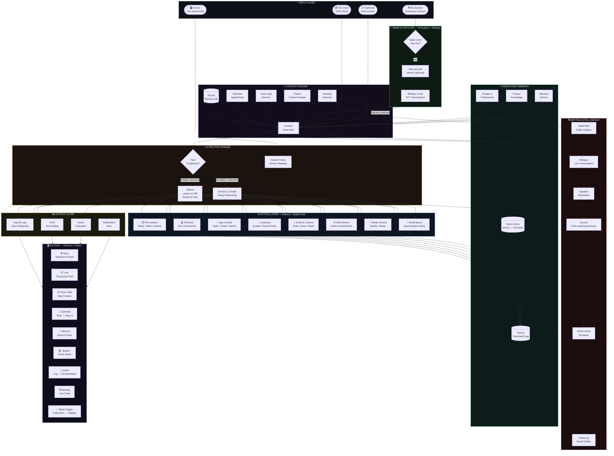

# ESI — System Architecture

```mermaid
flowchart TD
  subgraph INPUT["⚡ INPUT LAYER"]
    A1([🎙️ Microphone<br/>Continuous Stream])
    A2([⌨️ Text Input<br/>HUD Panel])
    A3([🖥️ Screen<br/>Live Screenshot])
    A4([📋 Clipboard<br/>Auto-monitor])
  end

  subgraph WAKE["🔔 WAKE & CAPTURE — Porcupine + Whisper"]
    B1{Wake word<br/>'Hey Esi'?}
    B2[Record until<br/>silence detected]
    B3[Whisper Local<br/>STT Transcription]
    A1 --> B1
    B1 -- Yes --> B2
    B2 --> B3
  end

  subgraph CONTEXT["🧠 CONTEXT ENGINE"]
    C1[(SQLite<br/>Memory DB)]
    C2[Calendar<br/>AppleScript]
    C3[Active App<br/>Detector]
    C4[Meeting<br/>Detector]
    C5[Project<br/>Context Reader]
    C6[Context<br/>Assembler]
    C1 & C2 & C3 & C4 & C5 --> C6
  end

  subgraph BRAIN["🤖 AI ROUTING ENGINE"]
    D1{Task<br/>Complexity?}
    D2[Ollama<br/>Llama 3.1 8B<br/>Simple & Fast]
    D3[Gemini 2.0 Flash<br/>Heavy Reasoning]
    D4[Gemini Vision<br/>Screen Reading]
    D1 -- Simple command --> D2
    D1 -- Complex / reasoning --> D3
    A3 --> D4
  end

  subgraph ACTIONS["⚙️ ACTION LAYER — Node.js + AppleScript"]
    E1[🗂️ File System<br/>Read / Write / Search]
    E2[💻 Terminal<br/>Run Commands]
    E3[📱 App Control<br/>Open / Close / Switch]
    E4[📅 Calendar<br/>Create / Read Events]
    E5[📧 Email & Comms<br/>Draft / Send / Read]
    E6[🌐 Web Search<br/>Fetch & Summarize]
    E7[🎵 Media Control<br/>Spotify / Music]
    E8[🔔 Notifications<br/>Read System Alerts]
  end

  subgraph MEETING["🎙️ MEETING INTELLIGENCE"]
    F1[BlackHole<br/>Audio Capture]
    F2[Whisper<br/>Live Transcription]
    F3[Speaker<br/>Diarization]
    F4[Gemini<br/>Post-meeting Summary]
    F5[Action Items<br/>Extractor]
    F6[Follow-up<br/>Email Drafter]
    F1 --> F2 --> F3 --> F4 --> F5 --> F6
  end

  subgraph MEMORY["💾 PERSISTENT MEMORY"]
    G1[(SQLite<br/>Command Log)]
    G2[(Vector Store<br/>Vectra — Semantic)]
    G3[People &<br/>Preferences]
    G4[Project<br/>Knowledge]
    G5[Meeting<br/>Archive]
  end

  subgraph OUTPUT["🔊 OUTPUT LAYER"]
    H1[macOS say<br/>Voice Response]
    H2[HUD<br/>Text Display]
    H3[Action<br/>Execution]
    H4[Notification<br/>Alert]
  end

  subgraph HUD["🖥️ ESI HUD — Electron + React"]
    I1[🎙️ Voice<br/>Waveform Panel]
    I2[📋 Live<br/>Transcript Feed]
    I3[⚙️ Active Task<br/>Step Tracker]
    I4[📅 Calendar<br/>Strip — Next 3]
    I5[🧠 Memory<br/>Recent Panel]
    I6[💻 System<br/>Pulse Panel]
    I7[📝 Action<br/>Log — Timestamped]
    I8[🎙️ Meeting<br/>Live Feed]
    I9[🔁 Mode Toggle<br/>Fullscreen ↔ Sidebar]
  end

  B3 --> C6
  A2 --> C6
  A4 --> C6
  C6 --> D1
  D2 & D3 --> E1 & E2 & E3 & E4 & E5 & E6 & E7 & E8
  D2 & D3 --> H1 & H2
  C4 -- Meeting detected --> F1
  E1 & E2 & E3 & E4 & E5 & E6 --> G1
  D3 --> G2
  H1 & H2 & H3 & H4 --> HUD
  G1 & G2 & G3 & G4 & G5 --> C6

  style INPUT fill:#0d1117,stroke:#30363d,color:#e6edf3
  style WAKE fill:#0d1b12,stroke:#4ade80,color:#e6edf3
  style CONTEXT fill:#130d1b,stroke:#a78bfa,color:#e6edf3
  style BRAIN fill:#1b130d,stroke:#f4c96a,color:#e6edf3
  style ACTIONS fill:#0d1520,stroke:#60a5fa,color:#e6edf3
  style MEETING fill:#1b0d0d,stroke:#f87171,color:#e6edf3
  style MEMORY fill:#0d1b1b,stroke:#34d399,color:#e6edf3
  style OUTPUT fill:#1b1b0d,stroke:#fbbf24,color:#e6edf3
  style HUD fill:#0d0d1b,stroke:#818cf8,color:#e6edf3
```
